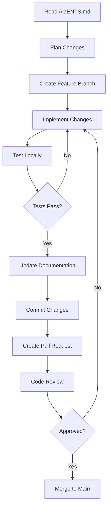

# WARP.md - Warp Terminal AI Agent Configuration

## 🚀 Project Overview

**Project:** Ansible Playbook for Anyone Protocol Anon Relay Deployment  
**Type:** Infrastructure as Code (IaC) - DevOps Automation  
**Language:** YAML (Ansible Playbooks), Jinja2 (Templates), Shell (Scripts)  
**Target:** Ubuntu, Debian, Fedora (amd64/arm64)  

This document configures Warp Terminal's AI assistant for optimal interaction with this Ansible project.

---

## 🎯 Quick Context for Warp AI

When using Warp AI in this project, remember:

1. **This is an Ansible project** - All playbooks must be idempotent
2. **Three relay types supported** - Standard, Exit, SOCKS Proxy
3. **Security-first approach** - Use Ansible Vault, proper permissions
4. **Multi-distribution support** - Ubuntu, Debian, Fedora
5. **Docker-based deployment** - Containers managed via Docker Compose

---

## 📋 Common Warp AI Commands

### Project Setup
```bash
# Install Ansible collections
ansible-galaxy collection install -r requirements.yml

# Validate syntax
ansible-playbook site.yml --syntax-check

# Lint playbooks
ansible-lint site.yml

# Check YAML formatting
yamllint .
```

### Deployment Commands
```bash
# Deploy standard relay
ansible-playbook -i inventory.ini deploy_standard.yml

# Deploy exit relay (requires legal acknowledgment)
ansible-playbook -i inventory.ini deploy_exit.yml \
  -e "anon_exit_legal_acknowledged=true"

# Deploy SOCKS proxy
ansible-playbook -i inventory.ini deploy_socks.yml

# Dry run (check mode)
ansible-playbook -i inventory.ini site.yml --check

# Deploy with verbose output
ansible-playbook -i inventory.ini site.yml -vvv
```

### Testing & Validation
```bash
# Run pre-commit hooks
pre-commit run --all-files

# Test Ansible connection
ansible all -i inventory.ini -m ping

# Check playbook syntax
ansible-playbook site.yml --syntax-check

# Validate role
ansible-playbook -i inventory.ini site.yml --tags docker --check
```

### Monitoring Commands
```bash
# Check relay container status
ansible relays -i inventory.ini -m shell -a "docker ps | grep anon-relay"

# View relay logs
ansible relays -i inventory.ini -m shell -a "docker logs anon-relay --tail 50"

# Check ORPort reachability
ansible relays -i inventory.ini -m shell -a "nc -zv <relay_ip> 9001"

# Monitor with Nyx (on relay server)
ssh relay1.example.com
sudo nyx -s /opt/anon/run/anon/control
```

### Git Operations
```bash
# Create feature branch
git checkout -b feature/new-role

# Commit with conventional format
git commit -m "feat(role): add exit relay configuration"
git commit -m "fix(playbook): correct permission on anon directory"
git commit -m "docs(readme): update installation instructions"

# Push feature branch
git push origin feature/new-role
```

---

## 🔧 Warp AI Prompt Templates

### For Ansible Development
```
Create an Ansible task that [describes what you need] following these requirements:
- Must be idempotent
- Use native Ansible modules (no shell unless necessary)
- Include proper error handling
- Add appropriate tags
- Document purpose with comments
```

### For Debugging
```
I'm getting this error in Ansible:
[paste error message]

The playbook is trying to [describe what should happen].
Help me debug this issue following Ansible best practices.
```

### For Role Creation
```
Create an Ansible role named [role_name] that:
- [Requirement 1]
- [Requirement 2]
- [Requirement 3]

Follow the project structure in AGENTS.md and ensure:
- Idempotency
- Cross-platform compatibility (Ubuntu/Debian/Fedora)
- Proper variable namespacing (anon_*)
- Comprehensive README.md
```

### For Refactoring
```
Refactor this Ansible code to:
- Improve idempotency
- Use native modules instead of shell
- Add proper error handling
- Follow project conventions in AGENTS.md

[paste code]
```

---

## 🏗️ Project Structure Reference

```
anon-relay-ansible-deployment/
├── AGENTS.md                    # Universal coding standards
├── CLAUDE.md                    # Claude-specific config
├── DEVELOPMENT_PLAN.md          # Project roadmap
├── README.md                    # User documentation
├── ansible.cfg                  # Ansible configuration
├── requirements.yml             # Galaxy dependencies
├── inventory.ini                # Host inventory
├── site.yml                     # Main playbook
├── deploy_standard.yml          # Standard relay deployment
├── deploy_exit.yml              # Exit relay deployment
├── deploy_socks.yml             # SOCKS proxy deployment
├── group_vars/                  # Group variables
│   ├── all.yml                  # Global settings
│   ├── standard_relays.yml      # Standard relay config
│   ├── exit_relays.yml          # Exit relay config
│   └── socks_proxies.yml        # SOCKS proxy config
└── roles/                       # Ansible roles
    ├── docker_setup/            # Docker installation
    ├── anon_relay_base/         # Base relay setup
    ├── anon_relay_standard/     # Standard relay config
    ├── anon_relay_exit/         # Exit relay config
    ├── anon_relay_socks/        # SOCKS proxy config
    ├── anon_relay_monitor/      # Monitoring setup
    ├── security_hardening/      # Security measures
    └── network_config/          # Network setup
```

---

## 📚 Key Files to Reference

| File | Purpose |
|------|---------|
| `AGENTS.md` | Universal coding standards and best practices |
| `CLAUDE.md` | Claude-specific agent configuration |
| `DEVELOPMENT_PLAN.md` | 12-week project development roadmap |
| `README.md` | User-facing project documentation |
| `ansible.cfg` | Ansible configuration settings |
| `requirements.yml` | Required Ansible Galaxy collections |

---

## 🔐 Security Reminders

When using Warp AI in this project:

1. **NEVER share secrets** - Don't paste API keys, passwords, or vault contents
2. **Use Ansible Vault** - All sensitive data must be encrypted
3. **Check permissions** - Files should use 600/644/755 permissions
4. **Exit relay caution** - Legal compliance required, not for home use
5. **Firewall rules** - Each relay type has specific port requirements

---

## 🧪 Testing Workflow

```bash
# 1. Syntax validation
ansible-playbook site.yml --syntax-check

# 2. Linting
ansible-lint site.yml
yamllint .

# 3. Dry run
ansible-playbook -i inventory.ini site.yml --check

# 4. Deploy to test environment
ansible-playbook -i inventory.ini site.yml --limit test-server

# 5. Verify idempotency
ansible-playbook -i inventory.ini site.yml --limit test-server
# Should show 0 changes on second run

# 6. Run pre-commit hooks
pre-commit run --all-files
```

---

## 🎯 Relay Type Quick Reference

### Standard Relay
- **Purpose:** Route encrypted traffic through network
- **Ports:** ORPort 9001
- **Hosting:** Home or datacenter OK
- **Maintenance:** Low

### Exit Relay
- **Purpose:** Final hop to public internet
- **Ports:** ORPort 9001, DirPort 80
- **Hosting:** ⚠️ NOT for home use, requires legal consultation
- **Maintenance:** High (abuse complaints)

### SOCKS Proxy
- **Purpose:** Local network proxy for LAN devices
- **Ports:** SocksPort 9050 (LAN only)
- **Hosting:** Local network only
- **Maintenance:** Low

---

## 💡 Warp AI Best Practices

### When Asking for Help
1. Provide full error message context
2. Mention what you've already tried
3. Specify the relay type if relevant
4. Include relevant file paths
5. Reference project conventions (AGENTS.md)

### When Generating Code
1. Request idempotent solutions
2. Ask for error handling
3. Specify cross-platform requirements
4. Request inline documentation
5. Ask for testing procedures

### When Debugging
1. Start with verbose output (-vvv)
2. Check ansible-lint output
3. Verify variable precedence
4. Test on clean environment
5. Validate with check mode first

---

## 🔗 External Resources

- **Ansible Docs:** https://docs.ansible.com
- **Anyone Protocol:** https://docs.anyone.io
- **Docker Docs:** https://docs.docker.com
- **Ansible Best Practices:** https://docs.ansible.com/ansible/latest/user_guide/playbooks_best_practices.html
- **Project GitHub:** [repository URL]

---

## 🚨 Common Issues & Solutions

### "Permission denied" errors
```bash
# Ensure user has sudo privileges
sudo usermod -aG sudo ubuntu

# Or use become in playbook
become: yes
```

### "Module not found" errors
```bash
# Install required collections
ansible-galaxy collection install -r requirements.yml
```

### Idempotency failures
```yaml
# Add changed_when for shell commands
- name: Check status
  shell: some-command
  register: result
  changed_when: false
```

### Container not starting
```bash
# Check logs
ansible relays -m shell -a "docker logs anon-relay"

# Verify configuration
ansible relays -m shell -a "cat /opt/anon/etc/anon/anonrc"
```

---

## 📊 Development Workflow



---

**Version:** 1.0.0  
**Last Updated:** 2025-10-27  
**Optimized for:** Warp Terminal AI Assistant  
**Project:** anon-relay-ansible-deployment

---

*Use Warp AI to accelerate development while maintaining code quality and security standards.*
